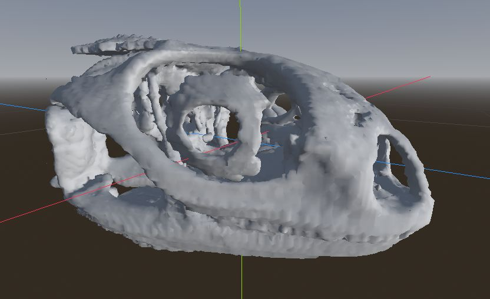
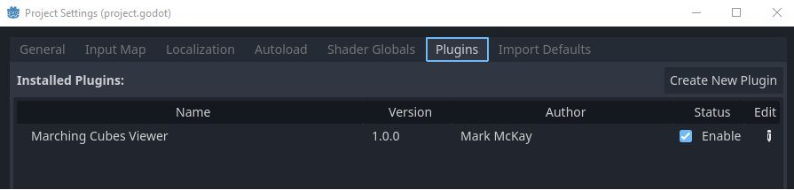
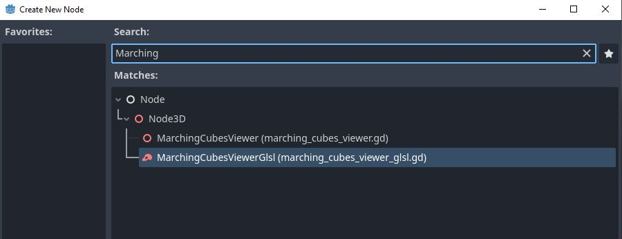
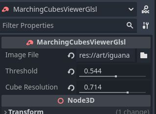
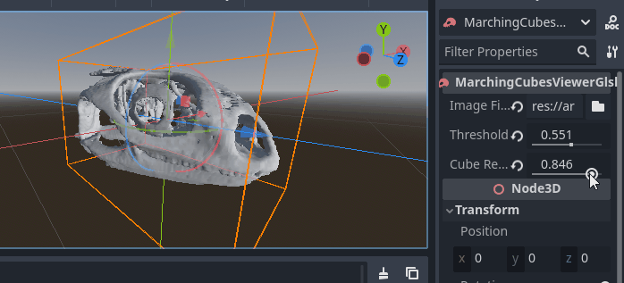

# Marching Cubes Viewer for Godot

This project provides an addon for Godot that lets you turn 3D volumetric data into meshesusing the marching cubes algorithm.  It uses GLSL compute shaders to keep things fast, so you must run this on a computer that supports GPU computation and a Godot mode that supports GPU shaders (that is, not Compatability mode).

## Installation

Download the archive and copy everything in the `/godot/addons/marching_cubes_viewer` directory into a directory with the same name in your project.  Then go into `Project Settings/Plugins` and enable the Marching Cubes Viewer plugin.

## Usage

You can create a new viewer object by clicking the `+` button in the top right of the `Scene` window and selecting a `MarchingCubesViewerGlsl` from the node list in the `Create New Node` window:

Once you've created a node, there are several parameters you can adjust:

* Image File - a zip file with a stack of images representing the different planes of your 3D volume
* Threshold - This determines the cutoff of the field.  Basically all voxles in your volume that are greater than this value are considered to be 'inside' and all the other voxels are 'outside'.  The mesh is then constructed that separates the inside from the outside.

* Cube Resolution - How dense to make this mesh.  This is rounded to the nearest mipmap level of your source volume.

## Support

If you found this software useful, please consider buying me a coffee on Kofi.  Every contribution helps me to make more software:

